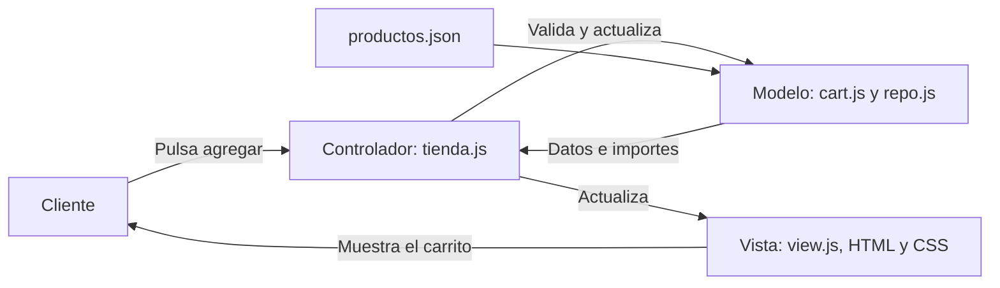

# Guía para defender Válora · Semana 6

**Estudiante:** Joel Robalino  
**Docente:** Marco Vinicio Vásquez Chávez  
**Paralelo:** 2  
**Proyecto:** Carrito de paquetes de catering Válora

Esta guía explica el funcionamiento con palabras sencillas. La demostración representa una compra, pero no cobra dinero ni confirma una reserva real.

La versión final presenta seis paquetes, cada uno con ocho menús y ocho complementos. La compra termina con «Compra exitosa» y vacía el carrito, incluso después de recargar. No solicita enviar el pedido por WhatsApp; esa integración queda para el futuro. Las imágenes son ilustrativas, generadas con `imagegen`; sus rutas y prompts están en [RECURSOS_VISUALES.md](RECURSOS_VISUALES.md).

## 1. Qué presentar en cinco a siete minutos

### Minuto 1: explicar el problema y la propuesta

Puedes decir:

> Mi proyecto es una página de catering llamada Válora. Antes mostraba información de los servicios y permitía preparar una consulta. Ahora el cliente puede elegir entre seis paquetes, configurar personas, menú y extras, revisar el total y finalizar su compra. Cuando termina, el carrito queda vacío para empezar otro pedido. Los precios son académicos y todavía no hay un sistema de cobro ni de recepción de pedidos en un servidor.

Muestra que la identidad visual y el contenido de la empresa siguen presentes. El carrito se incorpora al sitio existente.

### Minutos 2 y 3: configurar un paquete y usar el carrito

1. Abre la sección de paquetes y elige **Buffet empresarial**.
2. Indica **10 personas**, selecciona **Pollo con arroz y vegetales** y añade **Postre individual**.
3. Escribe una observación breve, por ejemplo: «Separar los postres para entregarlos al final».
4. Añade el paquete al carrito y muestra su configuración.
5. Cambia a **12 personas** para demostrar que el importe se actualiza. Después vuelve a 10.
6. Recarga la página y comprueba que el carrito se conserva.

Explicación del precio de este ejemplo:

```text
Precio base por persona:       USD 12,50
Menú elegido:                 USD  0,00 adicionales
Postre por persona:           USD  2,00
Precio por persona:           USD 14,50
10 personas:                  USD 145,00
Retiro:                       USD   0,00
Total con retiro:             USD 145,00
Domicilio de demostración:    USD   8,00 por pedido
Total con domicilio:          USD 153,00
```

Puedes decir:

> En catering, la cantidad representa personas. Cada extra se calcula por persona y la entrega se suma una sola vez al pedido. No guardo un total que pueda quedar desactualizado: lo calculo a partir del catálogo y de las opciones elegidas.

Muestra también dónde se puede editar, eliminar una línea o vaciar el carrito. Evita vaciar el pedido que usarás en el siguiente paso.

### Minutos 4 y 5: validar y finalizar la compra

1. Intenta continuar con un campo obligatorio vacío para mostrar el mensaje de error y su relación con el campo.
2. Utiliza datos ficticios: «Cliente de prueba», `cliente@example.com` y un teléfono de ejemplo con formato válido.
3. Escoge una fecha futura y la hora del evento. Si seleccionas domicilio, completa una dirección ficticia.
4. Corrige el error y revisa el resumen antes de confirmar.
5. Pulsa «Finalizar compra» y muestra la confirmación breve «Compra exitosa».
6. Muestra el contador del carrito en cero. Recarga la página para demostrar que los productos comprados no reaparecen. Agrega otro paquete para explicar que se puede empezar una nueva compra.

Puedes decir:

> El formulario valida los datos antes de continuar. La pantalla termina con «Compra exitosa». La aplicación vacía las líneas, actualiza el contador y los totales y guarda el carrito vacío para que los productos no vuelvan al recargar. También limpia los datos del evento. No obliga al cliente a enviar su pedido por WhatsApp. Este proyecto todavía no tiene una pasarela de pago ni recepción de pedidos en un servidor: la confirmación representa el recorrido local completado.

### Minuto 6: explicar cómo está organizado

Abre las carpetas `data`, `js` y `assets`. Muestra `productos.json`, `cart.js`, `view.js` y `tienda.js`.

> Separé los datos, las reglas y la pantalla. Así puedo cambiar un precio en el catálogo sin buscarlo dentro de todos los botones y puedo probar los cálculos sin abrir la página completa. Esta organización se relaciona con el patrón MVC de la semana 6.

### Minuto 7: accesibilidad, persistencia y límites

Recorre algunos controles con `Tab` y muestra el foco. Reduce el ancho de la ventana y señala que los controles se reorganizan. Explica que el carrito se guarda en el navegador, no en una cuenta en la nube.

> El proyecto es una aplicación de frontend. Tiene validación, almacenamiento local y una compra de demostración. Para convertirla en una tienda real harían falta validación y precios en un servidor, control de disponibilidad y un proveedor de pagos real.

## 2. MVC explicado sin complicaciones

MVC significa **Modelo, Vista y Controlador**. Son tres responsabilidades, no tres tecnologías que se tengan que instalar.



El **modelo** conoce los datos y las reglas: qué productos existen, qué opciones se aceptan y cómo se calcula el total. La **vista** muestra tarjetas, campos, mensajes y precios. El **controlador** conecta ambos: escucha un clic, pide un cambio al modelo y actualiza lo que ve el cliente.

Ejemplo: al añadir un postre, el controlador recibe la selección; el modelo calcula el nuevo importe; la vista muestra el resultado. La apariencia de la tarjeta no decide cuánto cuesta el postre.

## 3. Tecnologías: qué hace cada una

| Tecnología | Explicación sencilla | Ejemplo del proyecto |
|---|---|---|
| HTML5 semántico | Da significado y estructura al contenido | Cabecera, navegación, contenido principal, pie, botones y formularios |
| CSS3, Flexbox y Grid | Organizan la presentación y su adaptación al espacio | Tarjetas y carrito que se distribuyen según el ancho |
| JavaScript ES6+ | Responde a las acciones del usuario | Configurar, agregar, editar y eliminar paquetes |
| Módulos JavaScript | Dividen el programa en archivos con responsabilidades | `cart.js`, `repo.js`, `view.js` y `tienda.js` |
| JSON | Describe datos en un formato que JavaScript puede leer | Paquetes, menús, extras y precios en `data/productos.json` |
| Fetch | Lee un recurso del proyecto desde el navegador | Carga del catálogo local |
| IndexedDB | Conserva una copia local consultable | Respaldo de los catálogos públicos de productos y servicios |
| Regex | Comprueba si un texto sigue un formato | Formato de correo y teléfono |
| ARIA | Comunica estados y relaciones que cambian en pantalla | Campo inválido, ayuda asociada y mensajes dinámicos |

## 4. Los cuatro mecanismos de almacenamiento

| Mecanismo | Qué conserva | Cómo explicarlo |
|---|---|---|
| `localStorage` | Carrito, configuraciones y última actualización; también el tema del sitio | «Me permite recargar la página y recuperar el carrito en este navegador». |
| `sessionStorage` | Borradores opcionales de los formularios | «Si el visitante decide recordarlos, recupero esos datos en la misma pestaña». |
| `IndexedDB` | Catálogo público con una marca de tiempo | «Si falla la lectura del archivo, puedo usar una copia guardada de hasta siete días». |
| Cookie `valora-entrega` | Preferencia de retiro o domicilio durante hasta 30 días | «Recuerda una opción pequeña; no guarda nombre, dirección o teléfono». |

No significan lo mismo. El carrito contiene selecciones; el catálogo contiene información pública; el borrador contiene datos introducidos por el cliente. Por eso tienen un tratamiento distinto. Los datos personales solo se conservan como borrador cuando se activa esa opción.

Para demostrar IndexedDB, abre las herramientas del navegador con F12 y entra en **Application → IndexedDB**. En ambas bases abre el almacén `catalogos`: `valora-tienda` guarda productos con la clave `productos`; `valora-catalogo` guarda servicios con la clave `servicios-v3`.

También puedes mostrar dónde queda lo que escribe una persona en el formulario: activa **«Recordar mis datos en esta pestaña»**, escribe datos ficticios y abre **Application → Session Storage**. En la clave `valora-borrador-v1` verás el borrador guardado como JSON. Al desactivar la casilla o pulsar **«Borrar borrador guardado»**, se elimina. Para una demostración, usa datos inventados y luego bórralos.

Esta separación sigue el propósito de cada mecanismo: la Semana 5 presenta `sessionStorage` para conservar temporalmente un formulario y IndexedDB para datos estructurados como catálogos. No hace falta guardar los campos del formulario en IndexedDB para demostrar que persisten.

El almacenamiento pertenece al navegador y al origen de la web. No se sincroniza entre computadores ni entre la versión local y la publicada. Un navegador puede bloquearlo o eliminarlo. La copia de IndexedDB tampoco descarga toda la página para utilizarla sin conexión.

## 5. Validación y accesibilidad

Una expresión regular comprueba una forma. Por ejemplo, en un correo ayuda a detectar que falta `@` o que hay espacios donde no corresponden. Eso **no demuestra que la dirección exista**. También se comprueban campos obligatorios, límites de personas y fechas válidas.

`aria-invalid` indica que un campo tiene un error. `aria-describedby` relaciona el campo con su explicación. Los mensajes no dependen solo del color: también se escriben en texto. Los avisos de cambios permiten comunicar lo ocurrido sin obligar al visitante a buscarlo por toda la página.

Los datos escritos por el usuario se muestran como texto. Así una observación se trata como una observación, no como instrucciones HTML o JavaScript. Esta medida es distinta de comprobar el formato de un correo.

El teclado debe permitir llegar a los botones, elegir opciones, corregir errores y cerrar diálogos. El borde de foco ayuda a saber dónde se encuentra el usuario. Si se elimina un elemento, hay que mantener un lugar útil para continuar navegando.

## 6. Cómo se aplica la semana 6

Fuente: `semana 6 teoría.pdf`, de la asignatura Desarrollo en plataformas, 37 páginas.

| Tema del documento | Páginas | Aplicación |
|---|---:|---|
| jQuery y paso a una organización modular, sección 6.1 | 1–6 | Se separan datos, interfaz y comportamiento |
| DOM y eventos, sección 6.2 | 6–13 | Tarjetas y carrito se actualizan mediante funciones; eventos separados del HTML |
| Efectos y animaciones, sección 6.3 | 13–21 | Cambios claros y efectos breves que respetan movimiento reducido |
| Patrón MVC y módulos, sección 6.4 | 21–27 | Reglas en el modelo, pantalla en la vista y coordinación en el controlador |
| Lectura de datos y coherencia del modelo, sección 6.5 | 27–33 | JSON local validado, tratamiento de errores y copia pública del catálogo |

El documento utiliza jQuery como herramienta de enseñanza. En la página 22 también admite un controlador con JavaScript y en la 24 muestra módulos nativos. Por eso aquí se aplica MVC con JavaScript ES6+ sin añadir jQuery. La página 29 presenta Fetch para leer JSON sin dependencias externas.

CSV, XML, SQLite y Firestore se estudian como otras formas de obtener datos. El reto permite JSON o XML; este proyecto eligió JSON. No se afirma haber instalado esas otras tecnologías. Tampoco se utiliza React, Angular o Vue.

## 7. Preguntas que pueden hacerte

**¿Por qué convertiste servicios en productos?**  
Porque un paquete tiene un nombre, una descripción, un precio por persona y opciones. Eso permite compararlo, configurarlo y añadirlo al carrito, conservando la idea del negocio de catering.

**¿Qué pasa si cambio la cantidad de personas?**  
Se valida que esté dentro del rango y se vuelve a calcular el importe con el precio del menú y los extras. Los precios se manejan como centavos enteros para evitar imprecisiones en operaciones decimales.

**¿El precio lo decide el navegador?**  
En esta demostración se calcula con el JSON local. En una tienda real el servidor tendría que revisar precios y cantidades; no sería suficiente confiar en los datos enviados por un navegador.

**¿El pago es real?**  
No. La pantalla dice «Compra exitosa» porque se completó el recorrido del cliente, pero no hay una pasarela de pago ni se recogen datos bancarios. Tampoco se envía el pedido al negocio.

**¿Por qué ya no aparece WhatsApp al comprar?**  
Porque el cliente debe poder terminar el recorrido sin reenviar manualmente su pedido. La compra ahora termina en la página. La recepción de pedidos y sus notificaciones requieren una integración futura; no deben darse por implementadas.

**¿Por qué no reaparecen los productos al recargar?**  
Porque se actualiza tanto la pantalla como el carrito guardado en el navegador. Vaciar solo lo que se ve no sería suficiente. Se comprueba el resultado y, si hay un bloqueo que puede dejar productos guardados, se avisa antes de completar el recorrido.

**¿Qué ocurre si falla la carga del JSON?**  
Se informa el problema y se puede reintentar. Si existe una copia pública válida en IndexedDB, puede usarse como respaldo. Eso no convierte a toda la web en una aplicación sin conexión.

**¿Por qué no basta con abrir el HTML con doble clic?**  
Porque los módulos y Fetch necesitan cargar recursos desde un origen HTTP. Live Server entrega los archivos al navegador durante el desarrollo; no es un backend de compras.

**¿Se guardan en IndexedDB los datos que escribe el cliente en el formulario?**  
No. IndexedDB conserva copias de los catálogos públicos. Si la persona activa «Recordar mis datos», el borrador del formulario se guarda en `sessionStorage` en esa pestaña; enviar o preparar la cotización no escribe esos datos en IndexedDB.

**¿La página es una PWA instalable?**  
No. El proyecto usa módulos, catálogos JSON e IndexedDB como respaldo local; no incluye manifiesto ni service worker. La teoría de la Semana 6 pide explicar MVC y lectura de datos, no crear una PWA.

**¿Por qué no usaste jQuery?**  
Porque los módulos y las funciones nativas cubren las necesidades del proyecto. Apliqué los principios de organización y separación de responsabilidades que enseña la semana 6. La propia teoría presenta JavaScript nativo como una opción.

**¿La web ya está publicada?**  
Los archivos están preparados para Neocities. La publicación se realiza desde una cuenta y debe comprobarse en su dirección pública. No se debe afirmar que está publicada hasta hacer ese paso.

## 8. Preparación antes de la exposición

1. Conserva el ZIP entregable y una copia extraída del proyecto.
2. Abre `index.html` con Live Server y comprueba que la página carga por HTTP.
3. Vacía carritos o borradores de pruebas anteriores si quieres empezar una demostración limpia.
4. Ensaya el ejemplo de USD 145 con retiro o USD 153 con domicilio.
5. Usa una fecha futura y datos ficticios.
6. Deja preparados `productos.json`, `servicios.json`, `cart.js`, `repo.js`, `catalogo.js`, `view.js` y `tienda.js` para mostrar la separación por capas.
7. Ensaya el recorrido con teclado y con una ventana estrecha.
8. Finaliza una compra, comprueba el contador en cero y recarga. Después agrega un paquete diferente para mostrar que no se mezclan compras.
9. Para mostrar los almacenamientos, abre F12 → Application. En **IndexedDB**, despliega las dos bases y señala los catálogos. En **Session Storage**, activa antes la opción de borrador del formulario y muestra `valora-borrador-v1` con datos ficticios; después bórralo desde el formulario.

**Pruebas durante el desarrollo:** se validaron sintaxis, HTML, importes, almacenamiento y accesibilidad. Los resultados concretos y sus límites están en el README, que distingue las revisiones históricas de las comprobaciones de la versión final. Puedes explicarlo así: «Probé casos válidos y errores. La herramienta ayuda, pero no sustituye todas las pruebas humanas de accesibilidad».

Las instrucciones de ejecución y publicación están en [README.md](README.md), dentro de esta misma carpeta de documentación. Las pruebas mencionadas se realizaron durante el desarrollo; sus archivos se retiraron de la entrega final. El código de la página está en la carpeta superior.
